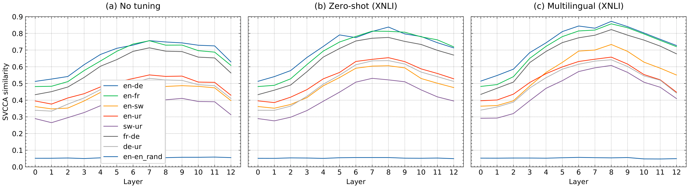
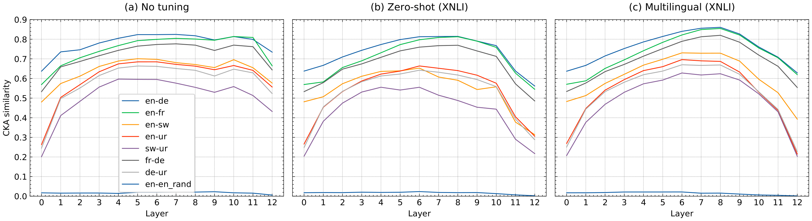
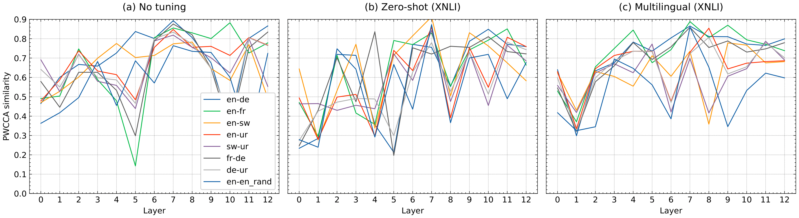
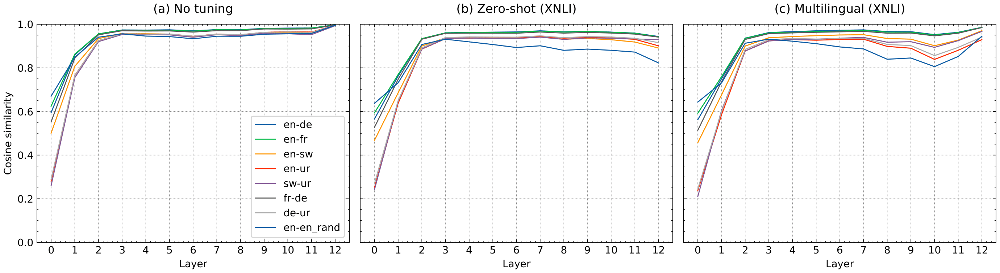

## Following graphs show that:
  * SVCCA and CKA pass the sanity check of the paraphrasing baseline (```en vs en_rand```)
  * SVCCA and CKA exhibit the interlingual pattern 
  * PWCCA and Cosine do not pass the sanity check (```en vs en_rand``` get just as high similarities) and thus do not exhibit a meaninful pattern
  
 ## SVCCA

 
 ## CKA

 
 ## PWCCA

 
## Cosine


 
